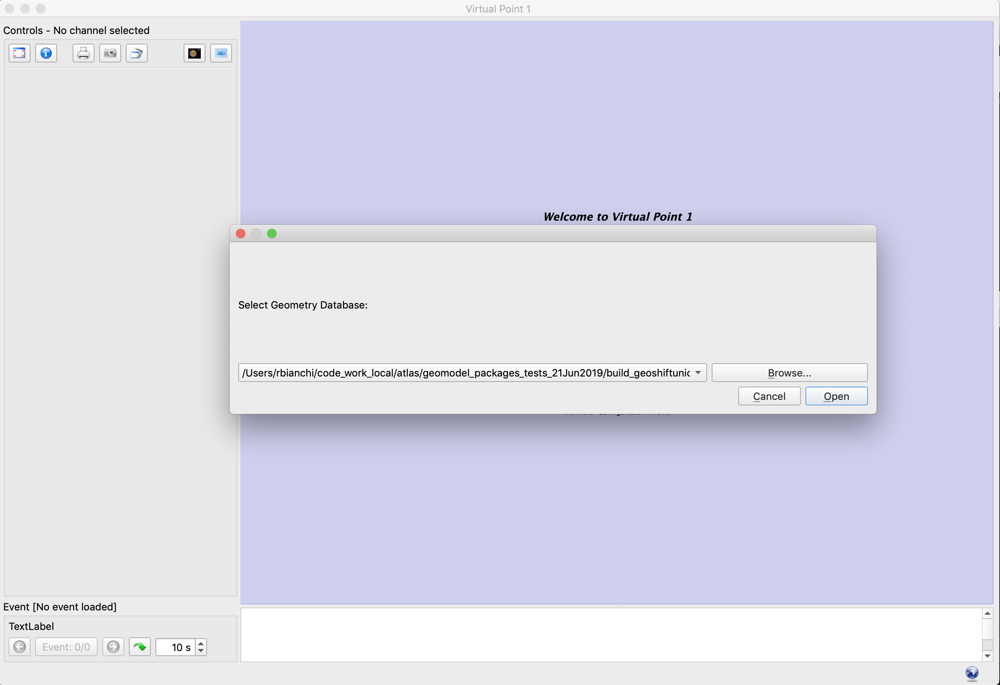
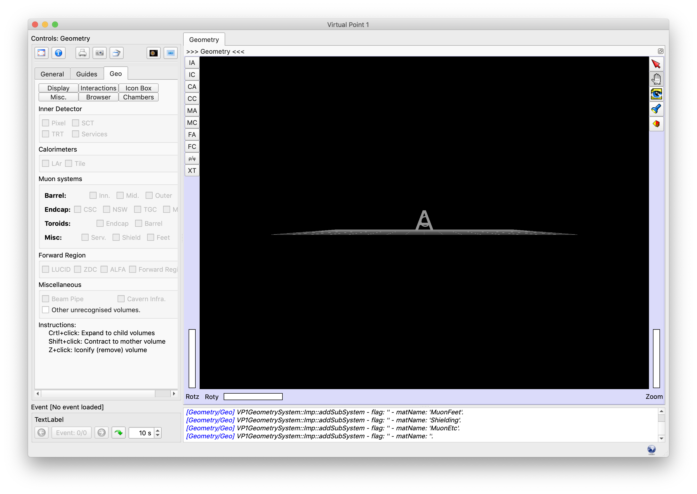
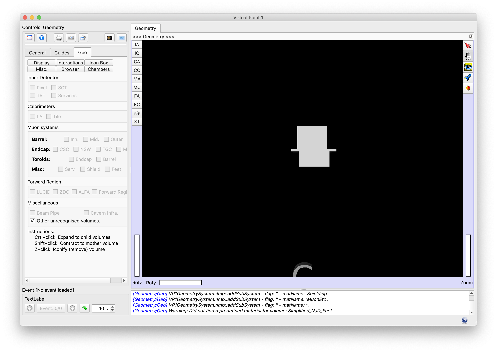

# TODO: TO BE UPDATED!!

# Visualizing the 'GeoShiftUnion' geometry with VP1Light


If you don't have VP1Light installed on your computer:

- On macOS, [you can install it with `brew`](https://github.com/ric-bianchi/homebrew-vp1light).
- On Ubuntu, or to build it from sources, please refer to [these instructions](https://gitlab.cern.ch/atlas/athena/tree/master/Projects/VP1Light).


Launch VP1Light from the command line:

```
vp1light
```

When the program starts, you will get the splash screen. Please, click on `Geometry studies`:


You will be prompted to choose a geometry file to load. Please, click on `Browse...`:



Now, choose the `geometry.db` file which we just created by running the `./geoShiftUnion` program and click on `Open`.

Once the loading of the file is completed (less than 1 second), you will see the main window of VP1Light, with the 3D content at the center.


Click on the `Geo` tab on the upper left (the one beside `General` and `Guides`):


Then, please click on the `Other unrecognized volumes` checkbox on the bottom of the `Geo` tab; this will switch ON the visualization of the piece of geometry we defined in the C++ code. It is listed under `Other unrecognized volumes` as it is not part of the ATLAS geometry.

Once clicked on the checkbox, you will see the piece of geometry placed at the center of the 3D "world", at the position (0,0,0).

As you can see, the dimensions of the piece of geometry we defined are very small compared to the default view, so you only see a little grey dot at around the center of the 3D window.  Let's zoom by clicking on the `IA` button in the column on the left of the 3D window. `IA` stands for "Inner Detector - side A" and it will set an enlarged view over the area occupied by the ATLAS Inner Detector subsystems. You can also use the `Zoom` wheel to enlarge the view.


You now have an enlarged view over the piece of geometry defined in the C++ code.


You can rotate the view by clicking and dragging the mouse on the 3D window while in "hand mode" (the "hand" button on the right column). Also, you can pan by clicking `Cmd+click` and drag.


For any other instructions and tutorials on VP1/VP1Light, please refer to [the VP1 website](https://atlas-vp1.web.cern.ch/).
