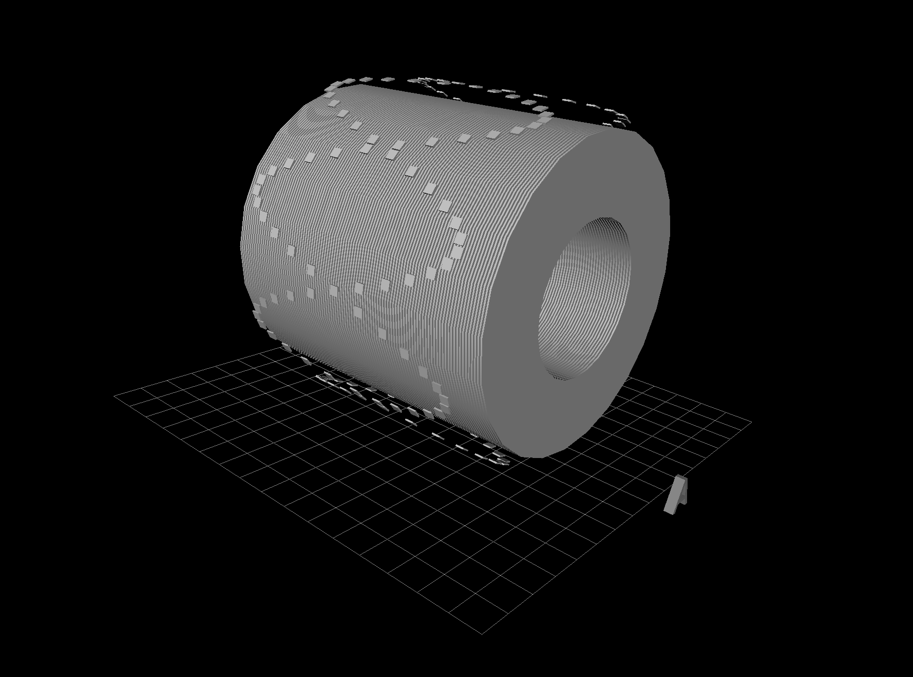
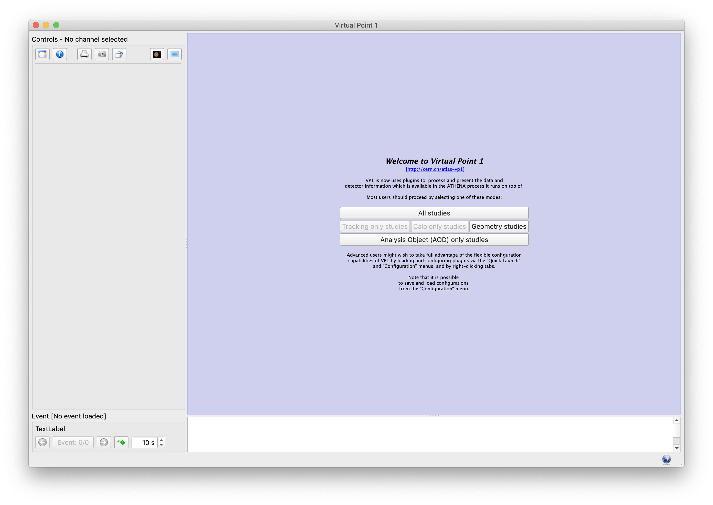
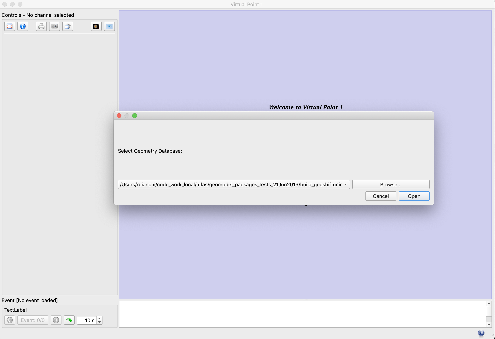
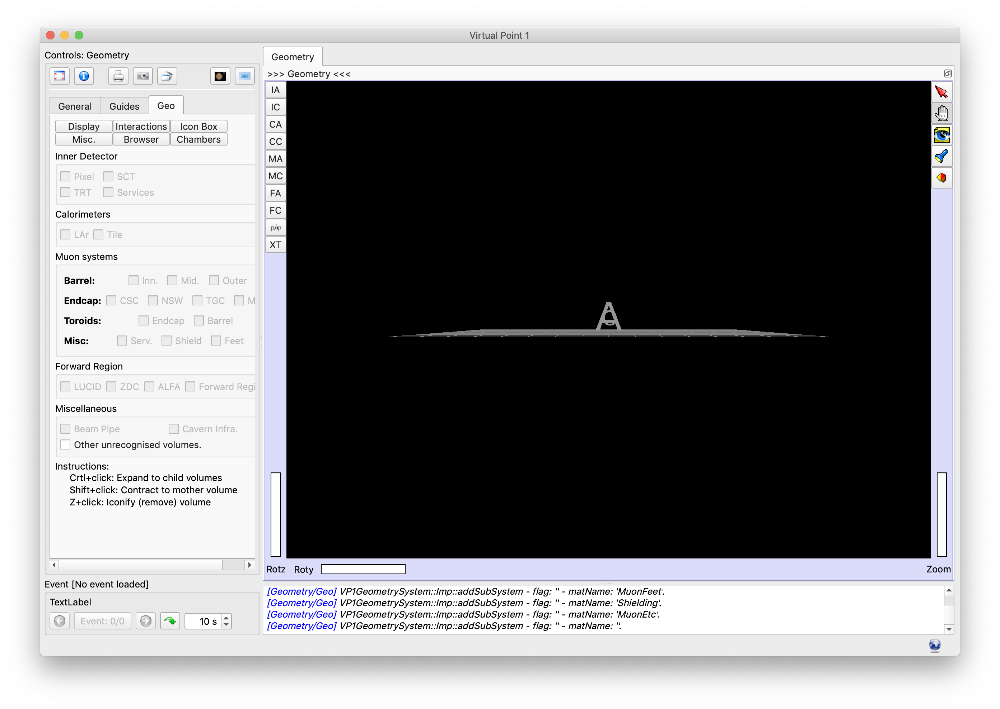
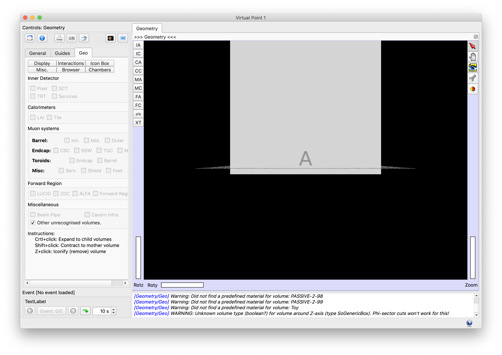
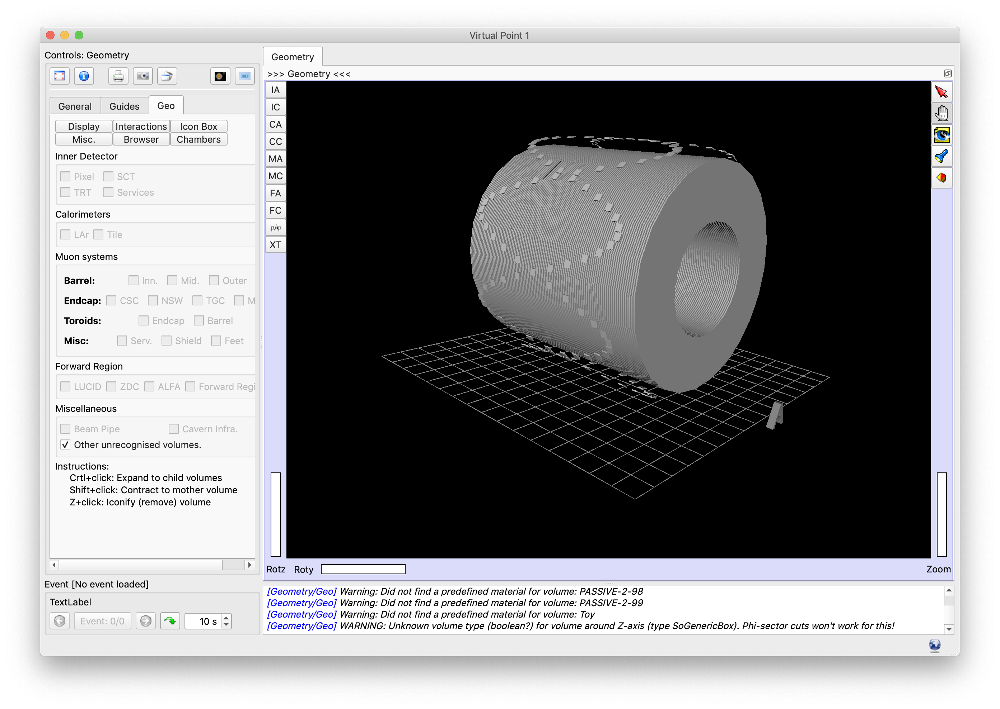
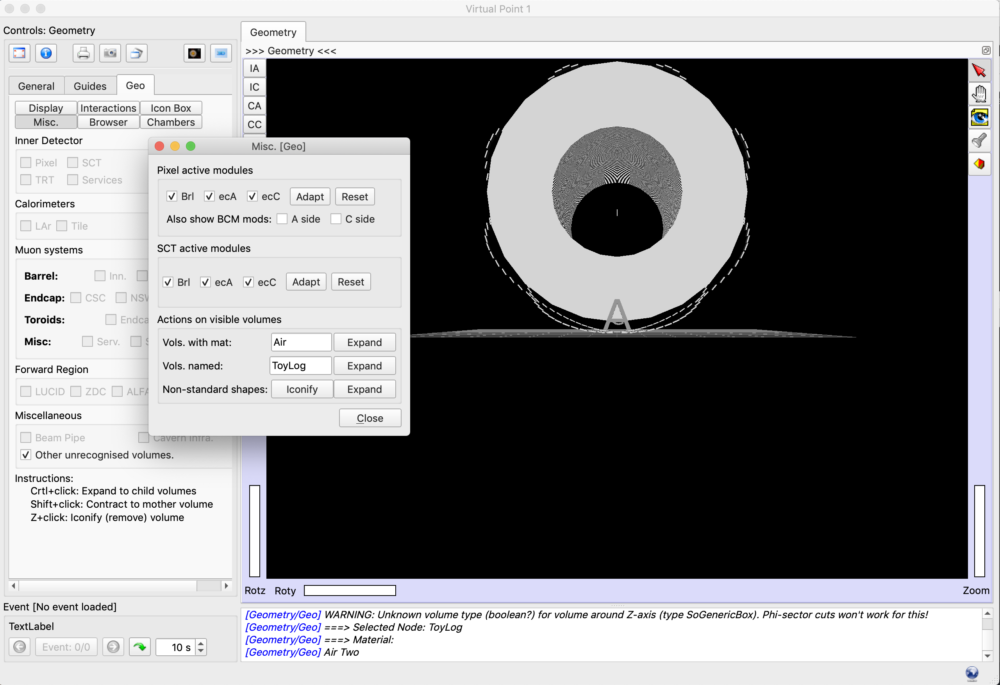

# TODO: TO BE UPDATED!!

# Visualizing the 'HelloToyDetectorFactory' geometry with VP1Light




If you don't have VP1Light installed on your computer:

- On macOS, [you can install it with `brew`](https://github.com/ric-bianchi/homebrew-vp1light).
- On Ubuntu, or to build it from sources, please refer to [these instructions](https://gitlab.cern.ch/atlas/athena/tree/master/Projects/VP1Light).


Launch VP1Light from the command line:

```
vp1light
```

When the program starts, you will get the splash screen. Please, click on `Geometry studies`:



You will be prompted to choose a geometry file to load. Please, click on `Browse...`:



Now, choose the `geometry.db` file which we just created by running the `./helloToyDetectorFactory` program and click on `Open`.

Once the loading of the file is completed (less than 1 second), you will see the main window of VP1Light, with the 3D content at the center.


Click on the `Geo` tab on the upper left (the one beside `General` and `Guides`):


Then, please click on the `Other unrecognized volumes` checkbox on the bottom of the `Geo` tab; this will switch ON the visualization of the piece of geometry we defined in the C++ code. It is listed under `Other unrecognized volumes` as it is not part of the ATLAS geometry.

Once clicked on the checkbox, you will see the piece of geometry placed at the center of the 3D "world", at the position (0,0,0).




What you see is the `ToyLog` volume, the box we set as the container of our piece of Geometry.

If you `Ctrl+click` (or `Cmd+click`) on it, you open it to see the child volumes.

[ _Note: on macOS Mojave there is an issue with the Cmd+click action. Please refer to [the Note below](#notes)_ ]

Now, you can see the 100 ring elements at the center, plus the two "spirals" of plates defined with the `GeoSerialTransformer` node.


You can rotate the view by clicking and dragging the mouse on the 3D window while in "hand mode" (the "hand" button on the right column).



For any other instructions and tutorials on VP1/VP1Light, please refer to [the VP1 website](https://atlas-vp1.web.cern.ch/).

----

## Notes

On macOS Mojave we observed an issue with the Cmd+click action. For the moment, you can open the container volume by using the "Expand volume" tool in VP1Light.

While on the "Geo" tab, click on the "Misc." button.

Then, write the name of the volume, "ToyLog", in the "Vols. named" field and click on "Expand". This will open up the container volume to show to you the inner, child volumes.


