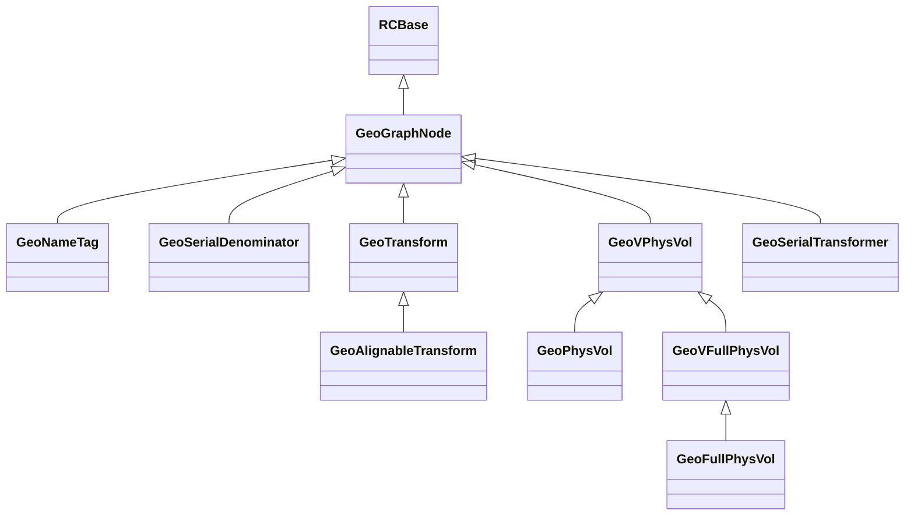

## Physical Volumes

Physical volumes are objects that have a single logical volume and list of daughters.  These daughters can have several types:

 * Physical volume.
 * Physical volume property nodes, such as name tags, or transformations.
 * Parametrizations of physical volumes.

These types of daughters are referred to collectively as `GeoGraphNodes`.  Physical volumes and graph nodes are the building blocks of the *geometry graph*.  The geometry graph is a specification of a *physical volume tree*, which, when traversed at a later time, appears to consist of physical volumes within other physical volumes.

**Unlike other geometry modelers, in GeoModel physical volumes live within other physical volumes and not within logical volumes. This simplifies tree traversal.**

In GeoModel there are two main types of physical volumes, `GeoPhysVol` and `GeoFullPhysVol`.  These in turn each have an interface class, `GeoVPhysVol` and `GeoVFullPhysVol`[^PV1]. The user needs to be concerned only with the classes `GeoPhysVol` and `GeoFullPhysVol`.  The former is generally used for nondescript pieces of detector geometry whose absolute position in space is not accessed often; while the latter is used typically for active detector components whose absolution position in space is used frequently within reconstruction, or digitization or hit creation.
`GeoFullPhysVol` has a method for caching important information like absolute transformation of the piece with respect to the global coordinates, default transformation, and the name.

[^PV1]: The reason for the interface classes is to provide a hook for virtual physical volumes which use recipes to generate children that do not actually exist permanently in memory.  So far this has not been necessary to achieve parameterization, but we do not for now rule out the need for an interface class.

{!components/kernel/reference/RCBase/GeoPhysVol.md!}

{!components/kernel/reference/RCBase/GeoFullPhysVol.md!}