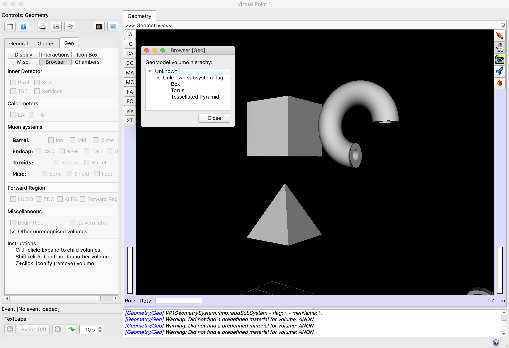

# The 'GeoShapeExamples' GeoModel example



The `GeoShapeExamples` example shows you how to use different GeoShape nodes (GeoBox, GeoCone, GeoTorus, GeoTessellatedSolid, ...) and saves them to a local file.

The example program:

 1. Builds different example GeoModel shapes
 2. Writes the outcome geometry to an SQLite file

## Dependencies

### Install Qt5

To build and run GeoModel I/O libraries, you must have a working Qt5 installation on your computer.
If you are not sure how to install it, please take a look at the Appendix, below.


## Quick Instructions

### macOS Mojave

To quickly install everything, we use [Homebrew](). If you don't have installed it on your computer, please install it by following the [instructions on its website](https://brew.sh/).

#### Install the dependencies

Install the dependencies, [GeoModelCore](https://gitlab.cern.ch/GeoModelDev/GeoModelCore) and [GeoModelIO](https://gitlab.cern.ch/GeoModelDev/GeoModelIO):

```
brew tap atlas/geomodel https://gitlab.cern.ch/GeoModelDev/packaging/homebrew-geomodel.git
brew install geomodelcore geomodelio
```

#### Build the example code

After that, get the example code and compile the example:

```
git clone https://gitlab.cern.ch/GeoModelDev/GeoModelExamples.git
mkdir build_geoshapes
cd build_geoshapes
cmake ../GeoModelExamples/GeoShapeExamples
make
```

#### Run the example code

Then you can run the example program:

```
./geoShapeExamples
```

When the program terminates, you will find a `geometry.db` file in the build folder. This is a SQLite file containing the dump of the geometry defined in the example C++ code. You can use it to visualize the shapes built in the example code, as explained in the following.

## Visualization

You can visualize the outcome of the example code, by opening it with VP1Light. Please refer to the [Visualization documentation](docs/visualization.md).


----

## Appendix

### Notes on Qt5

To build and run GeoModel I/O libraries, you must have a working Qt5 installation on your computer. Qt5 classes are used for I/O operations with the underlying SQLite daemon, to store/handle data, and to handle logging.

If you are not sure how to install it, please take a look at [the notes on Qt5, in the GeoModelIO repository](https://gitlab.cern.ch/GeoModelDev/GeoModelIO/blob/main/README_QT5_NOTES.md).
