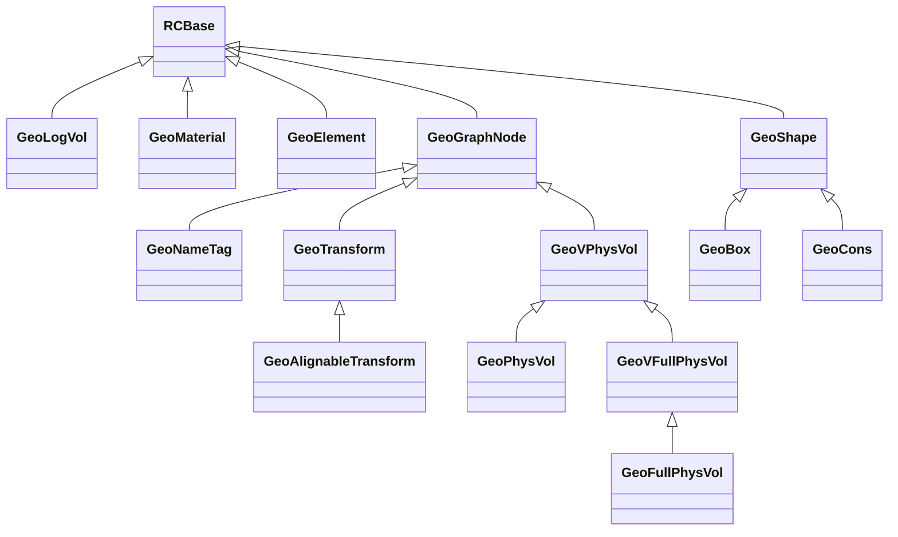

## GeoModel Kernel Overview

In this section we give a short overview of all of the pieces of the GeoModel Kernel. These pieces are described in detail in the kernel [Class Reference](../reference). In this section our goal is to describe the “big picture”.  A subset of the GeoModel kernel class tree is shown on the diagram below.

Many of the classes in the library represent objects which are reference counted; these all inherit from `RCBase`.  Others represent geometrical shapes; these inherit from `GeoShape`.  Others represent objects that can be assembled into a geometry graph; these inherit from `GeoGraphNode`.

{!components/kernel/overview/MaterialGeometry.md!}
